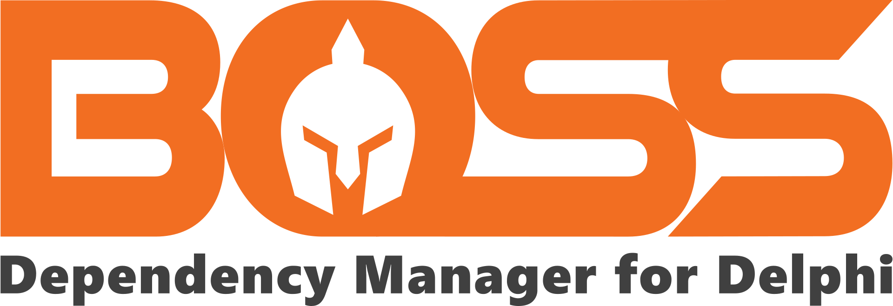
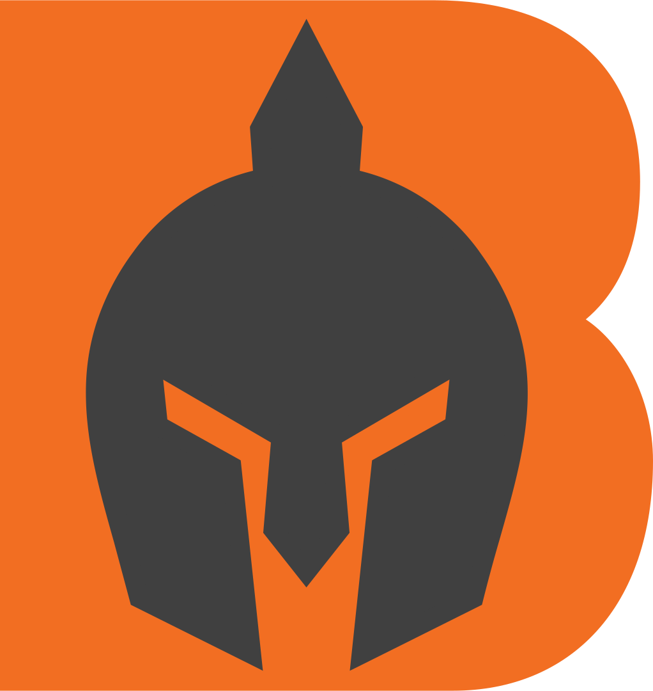
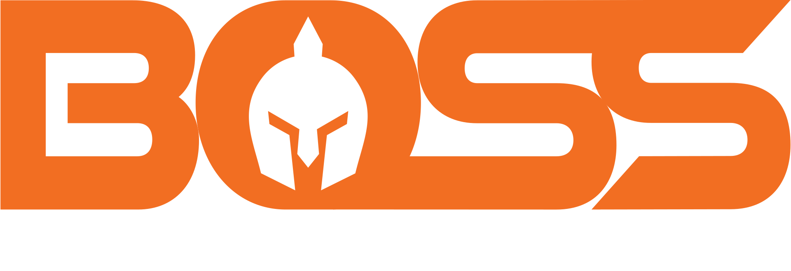
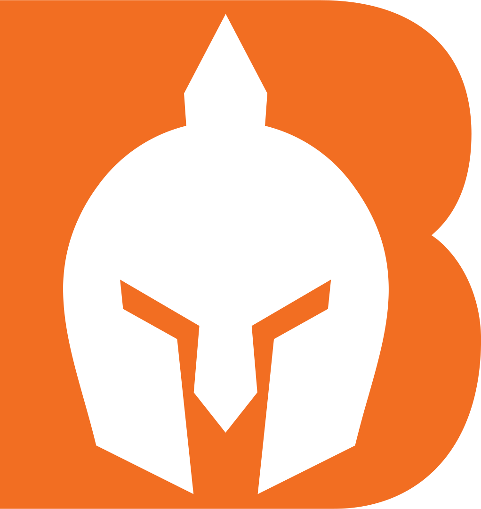

The following logos and graphics are for the promption of the Boss project.

* [Spartan Helmet](https://thenounproject.com/icon/spartan-helmet-1732608/) logo by [Jon Ramadhan](https://thenounproject.com/joni45/) via [The Noun Project](https://thenounproject.com/), via Royalty-Free, non-attribution, pro license only for use in this logo.
* Font is [Good Times](https://fonts.adobe.com/fonts/good-times) Heavy, designed by [Ray Larabie](https://fonts.adobe.com/designers/ray-larabie), [Typodermic](https://fonts.adobe.com/foundries/typodermic) via [Adobe Fonts](https://fonts.adobe.com/)
* AI source files created using [Adobe Illustrator](https://www.adobe.com/products/illustrator.html) v26.3.1 Creative Cloud 2022. 
* PNG files optimized by [TinyPNG](https://tinypng.com/)
* SVG files otpimized with [Jake Archibald's SVGOMG](https://jakearchibald.github.io/svgomg/)
* Tested and compatible in [InkScape](https://inkscape.org/) 1.2

## [Boss Logo](./svg/Boss Logo.svg)

## [Boss Icon](./svg/Boss Icon.svg)

## Variations
[Boss Logo - white text](./svg/Boss Logo - white text.svg)

[Boss Icon - white](./svg/Boss Icon - white.svg)

[Boss Logo - white helmet](./svg/boss Logo - white helmet.svg)

[Boss Logo - white text and helmet](./svg/boss Logo - white text and helmet.svg)

[Boss Logo - white helmet without text](./svg/boss Logo - white helmet wo text.svg)

[Boss Logo - without text](./svg/boss Logo - wo text.svg)
