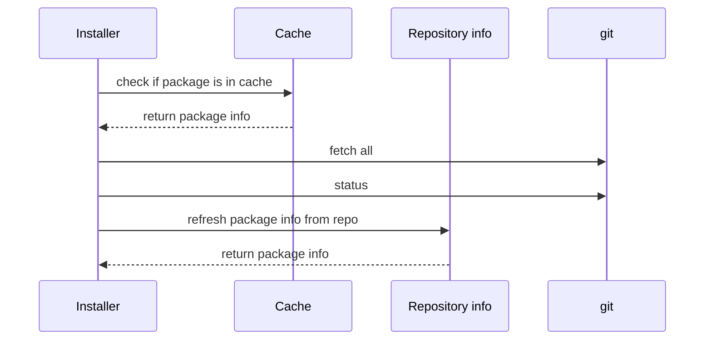

# Installer

## Ensure dependency

```mermaid
sequenceDiagram
    participant installer as Installer
    participant cache as Cache
    participant repoInfo as Repository info
    participant git

    installer->>cache: check if package is in cache
    cache-->>installer: return package info

    installer->>git: fetch all
    installer->>git: status

    installer->>repoInfo: refresh package info from repo
    repoInfo-->>installer: return package info
```
